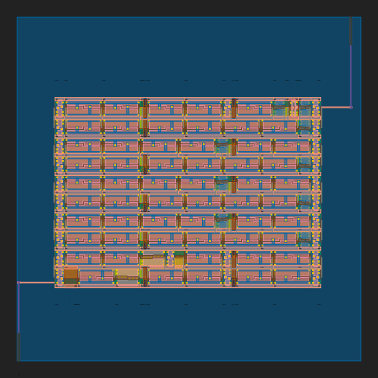

# Silicon Notebooks

Build open silicon using [Jupyter](https://jupyter.org/) and [Colab](https://colab.research.google.com/) notebooks.

## Notebooks

### Digital Inverter with OpenLane 

[digital-inverter-openlane.ipynb](digital-inverter-openlane.ipynb) 

Run a simple inverter design thru the [OpenLane](https://github.com/The-OpenROAD-Project/OpenLane/) GDS to RTL flow targeting the [open source SKY130 PDK](https://github.com/google/skywater-pdk/).

### Analog Inverter with Magic

[analog-inverter-openlane.ipynb](analog-inverter-openlane.ipynb) 

Draw a simple mosfet for the [open source SKY130 PDK](https://github.com/google/skywater-pdk/) using [MAGIC](https://github.com/RTimothyEdwards/magic) and simulate it in an inverter circuit using [PySpice](https://pyspice.fabrice-salvaire.fr/).

